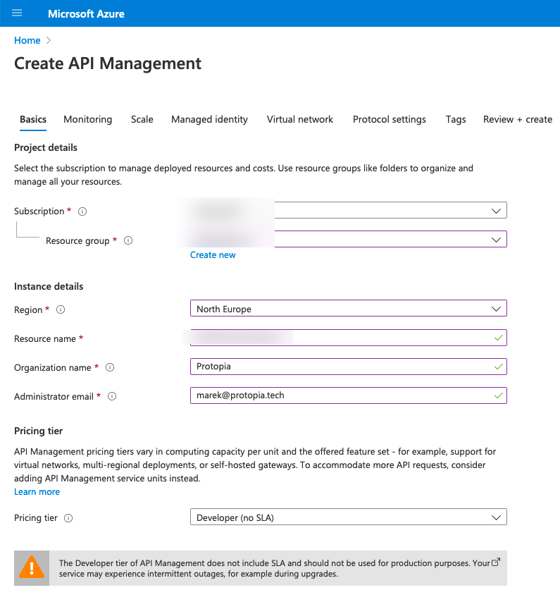
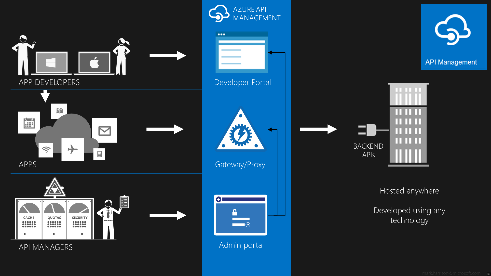
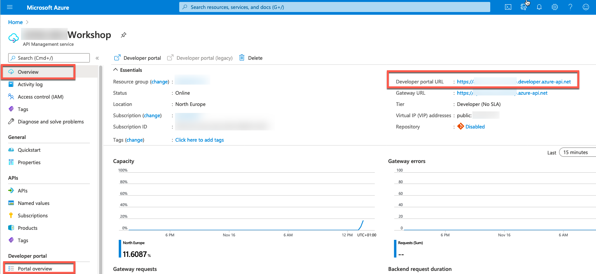

# Azure API Management - Warsztat zapoznawczy - Lab 1

- [Spis treści](README.md)
- [Lab 1 - Utworzenie instancji API Management](apimanagement-1.md)
- [Lab 2 - Portal dewelopera i tworzenie produktów](apimanagement-2.md)
- [Lab 3 - Konfiguracja API](apimanagement-3.md)
- [Lab 4 - Wyrażenia polityk API](apimanagement-4.md)
- [Lab 5 - Wersjonowanie, rewizje, mokowanie](apimanagement-5.md)
- [Lab 6 - Monitorowanie usługi](apimanagement-6.md)
- [Lab 7 - Aspekty bezpieczeństwa](apimanagement-7.md)

## Tworzenie instancji Azure API Management

Tworzenie instancji API Management zajmuje do godziny. Wykonajmy ten krok przed rozpoczęciem warsztatu.

Używając odpowiednich wartości naciśnij [Create] by utworzyć usługę.

- Nazwa instancji musi być unikalna.
- Na potrzeby warsztatu używamy Developer Tier.

Po utworzeniu usługi uzyskasz dostęp do nastepujących elementów:

- Portal administracyjny/publikacyjcny - (obecnie dostępny w Azure Management Portal - stary Publisher Portal nie jest już dostępny)
- Portal Developera
- Brama API hostowana w Azure

Link do portalu developera można znaleźć w prawym górnym rogu zakładki Overview w Portalu.

---

[Spis treści](README.md) | [Lab 2 - Portal dewelopera i tworzenie produktów](apimanagement-2.md)
