# Azure API Management - Warsztat zapoznawczy - Lab 2

- [Spis treści](README.md)
- [Lab 1 - Utworzenie instancji API Management](apimanagement-1.md)
- [Lab 2 - Portal dewelopera i tworzenie produktów](apimanagement-2.md)
- [Lab 3 - Konfiguracja API](apimanagement-3.md)
- [Lab 4 - Wyrażenia polityk API](apimanagement-4.md)
- [Lab 5 - Wersjonowanie, rewizje, mokowanie](apimanagement-5.md)
- [Lab 6 - Monitorowanie usługi](apimanagement-6.md)
- [Lab 7 - Aspekty bezpieczeństwa](apimanagement-7.md)

## Developer Portal

Developer Portal jest miejscem gdzie użytkownicy API mogą się zarejestrować, wyszukać interesujące ich API, a następnie zapoznać się z dokumentacją, poprosić o dostęp i przetetsować działanie API. Zawartość Developer Portalu generowana jest automatycznie w oparciu o ostawienia wykonane w Publicher Portalu (czyli w Portalu Azure). Link do Twojego Developer Portalu to: https://{twoja-instancja-api}.developer.azure-api.net

Wejście do Developer Portalu poprzez link na Portalu Azure umożliwia dostosowanie jego zawartości w trybie administratora.

Uruchomienie Portalu Developera wykonywane jest z poziomu Portalu Azure (zakładka Portal overwiew). Wchodząc po raz pierwszy i każdorazowo po wprowadzeniu zmian używamy menu `Operations` oraz `Publish Website`. Spowodouje to opublikowanie zmian w portalu i udostępnienie ich użytkownikom.

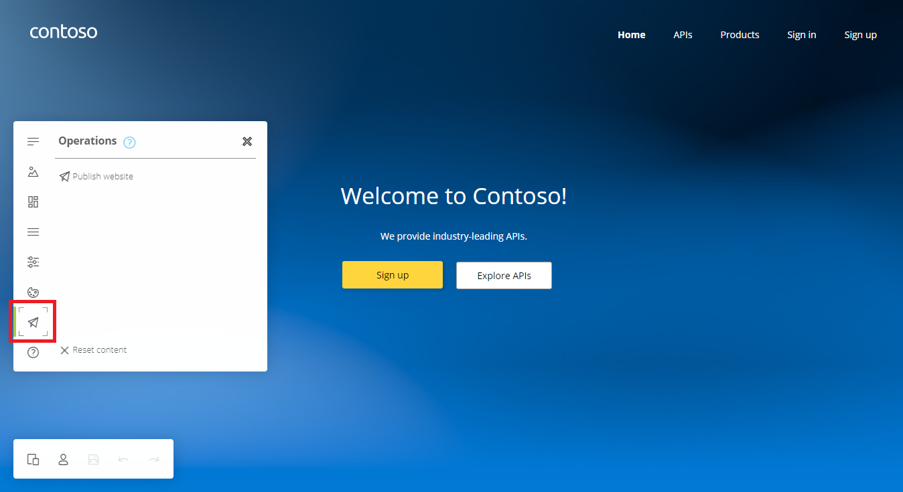

### Działanie Portalu Developera

Zacznijmy od obejrzenia działania Developer Portalu w praktyce

#### Dostęp anonimowy

Jako niezalogowany użytkownik (otworzenie adresu twojego Developer Portalu w przeglądarce) wyświetl listę dostępnych produktów.

> Sprawdź różnice między produktami Starter i Unlimited.

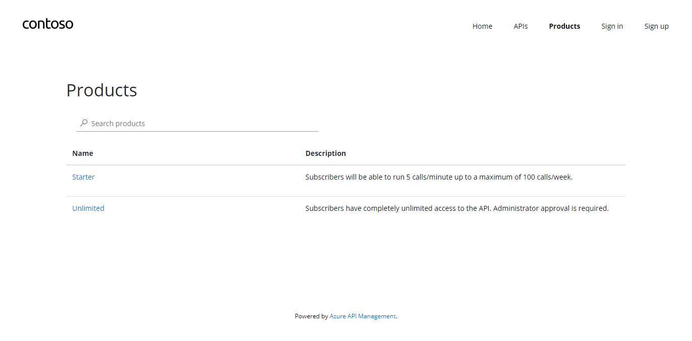

Możesz sprawdzić również listę opublikowanych API. Można je testować bezpośrednio z poziomu Developer Portalu. Do tego będzie jednak potrzebne poprawne skonfigurowanie CORS z poziomu Portalu Azure (zakładka Portal overwiew).

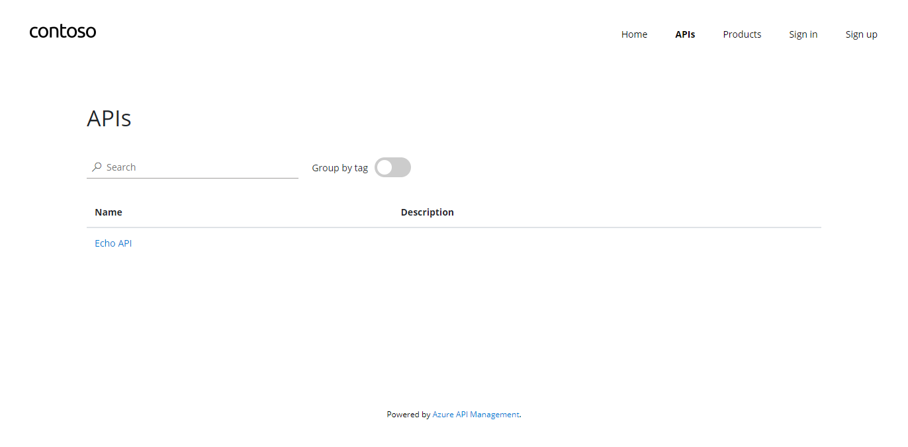

#### Zarejestruj się jako developer

- Kliknij link SignUp w Develoepr Portalu (jeżeli jesteś już zalogowany/zalogowana jako administrator, wyloguj się).
- Uzupełnij wymagane dane
- Sprawdź wiadomość dotyczącą aktywacji konta w swojej skrzynce email. Wykonaj aktywację.
- Zaloguj się jako developer

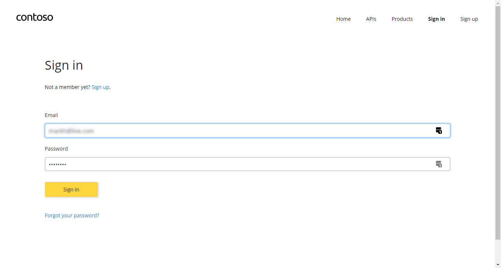

Wybierze "Starter Product" i aktywuj subskrypcję "Starter".

- Sprawdź email - subskrypcja została automatycznie aktywowana i został do niej przydzielony klucz.

Wybierze "Unlimited Product" i aktywuj subskrypcję "Unlimited".

- Sprawdź email - ta subskrypcja wymaga aktywacji.

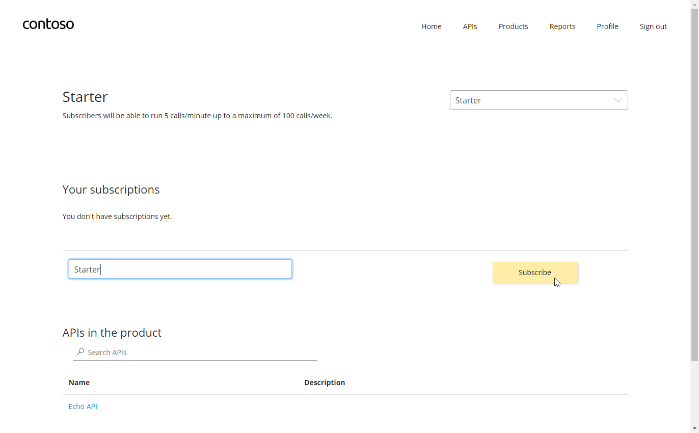

Na swoim profilu użytkownika sprawdź aktywne subskrypcje

- Twoja subskrypcja "Starter" jest już aktywna, natomiast "Unlimited" czeka na akceptację przez administratora (status=submitted)

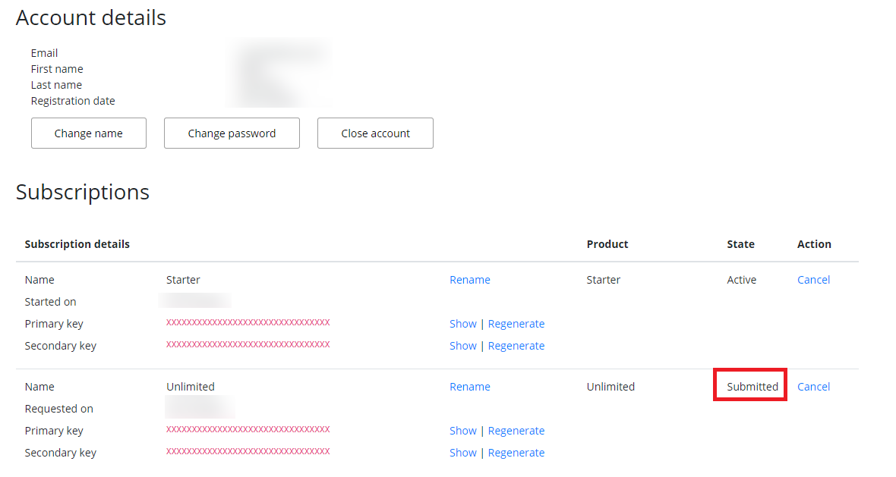

Możesz aktywować subskrypcję na dwa sposoby:

- Wybierając w Portalu Azure `Users` następnie developera i dalej `Subcriptions`. Menu kontektowe po prawej stronie i aktywacja.
- Wybierając w Portalu Azure `Products` następnie `Unlimited` i dalej `Subcriptions`. Menu kontektowe po prawej stronie i aktywacja.

#### Testowe wywołanie API

Wejdź na listę produktów, wybierz Starter a następnie listę przypisanych do niego API.

- Naciśnij przycisk TryIt
- Wybierz klucz subskrypcji
- Przetestuj operację GET `Retrieve resources' (jeżeli pojawi się błąd CORS, naprawimy to za chwilę)

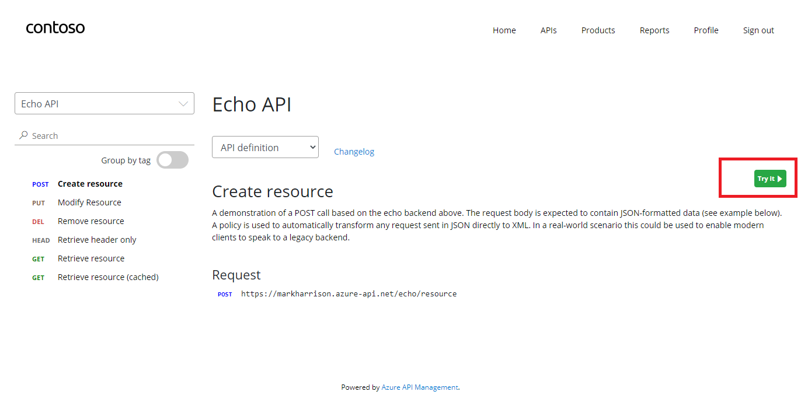

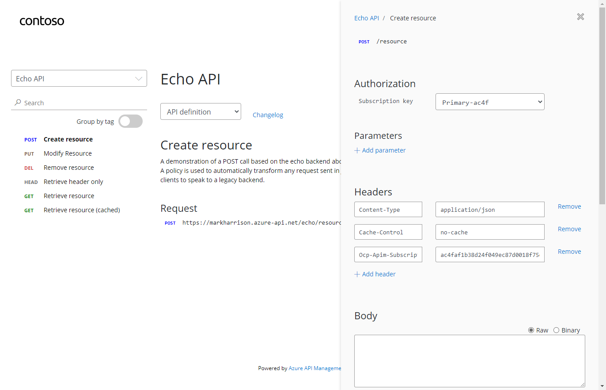

### Dostosowywanie Portalu Developera

#### Wygląd Portalu

Developer Portal bazuje na Paperbits Web framework <https://paperbits.io/>, przy czym jest wzbogacony o dodatkowe funkcje specyficzne dla Azure API Management. Rozszerzony kod Portalu Developera można znaleźć tutaj: <https://github.com/Azure/api-management-developer-portal>.

Istnieje możliwość hostowania Developer Portalu poza usługą Azure API Management. Jest to opcja zaawansowana umożliwiająca budowanie własnych funkcji, rozszerzeń ale też integrację płatności i monetyzacji. Szczegóły znajdują się tutaj: <https://github.com/Azure/api-management-developer-portal/wiki>/ and <https://docs.microsoft.com/en-us/azure/api-management/api-management-howto-developer-portal>.

Przed pierwszą publikacją portalu wzkazane jest jego dostosowanie do wymogów twojej firmy. Wśród zalecanych zmian są między innymi: layout, style i oczywiście zawartość strony głównej. Szczegóły opisane są tutaj: <https://docs.microsoft.com/en-us/azure/api-management/api-management-howto-developer-portal-customize>

W wolnej chwili objerzyj nagranie dotyczące dostosowywania Portalu Developera: <https://www.youtube.com/watch?v=5mMtUSmfUlw>

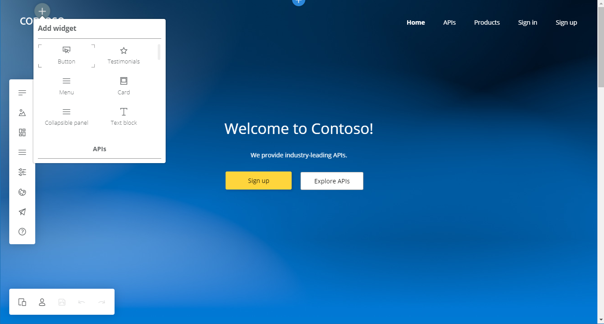

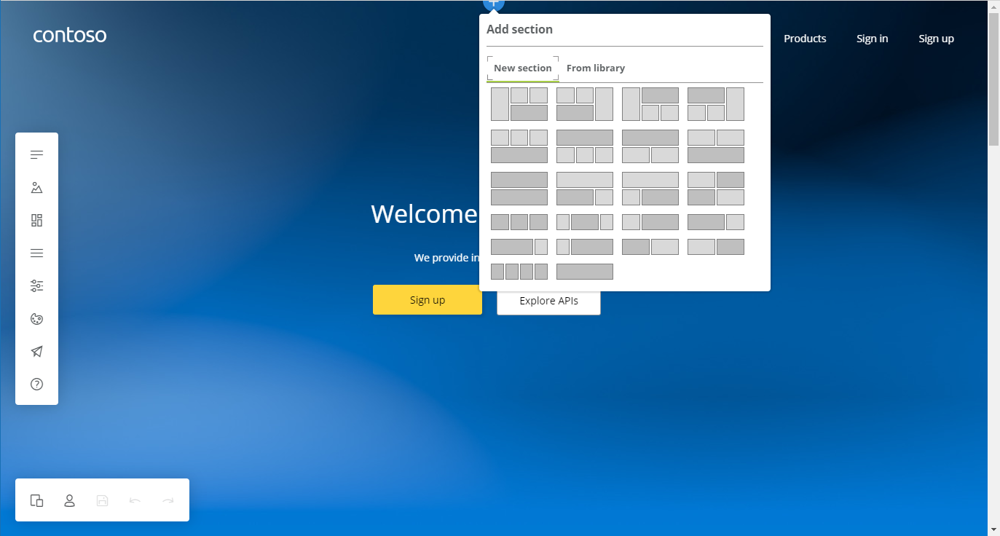

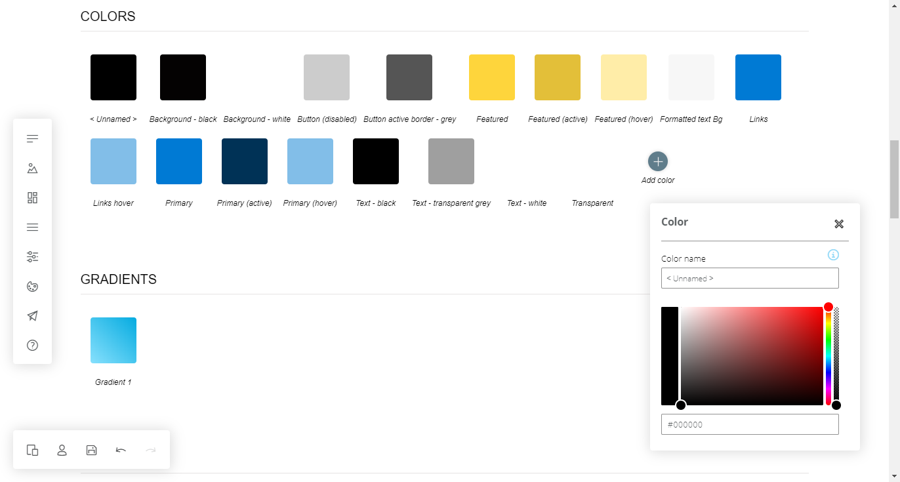

#### Konfiguracja powiadomień mailowych

Szablony powiadomień mailowych można modyfikować z poziomu Portalu Azure. Do dyspozycji mamy zestaw dynamicznie podstawianych parametrów.

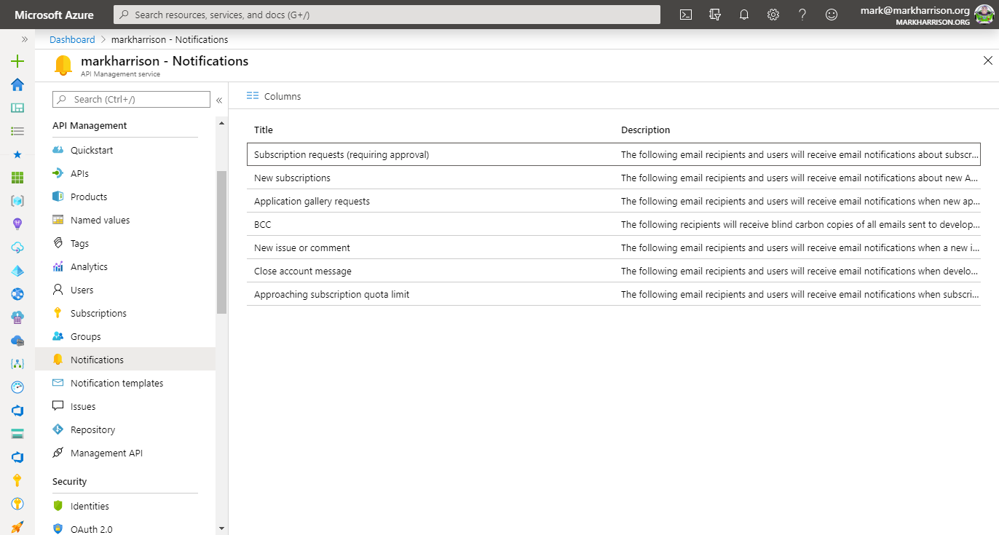

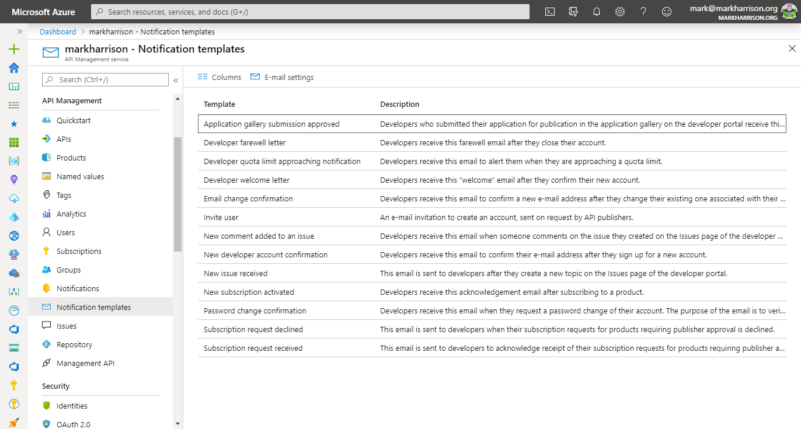

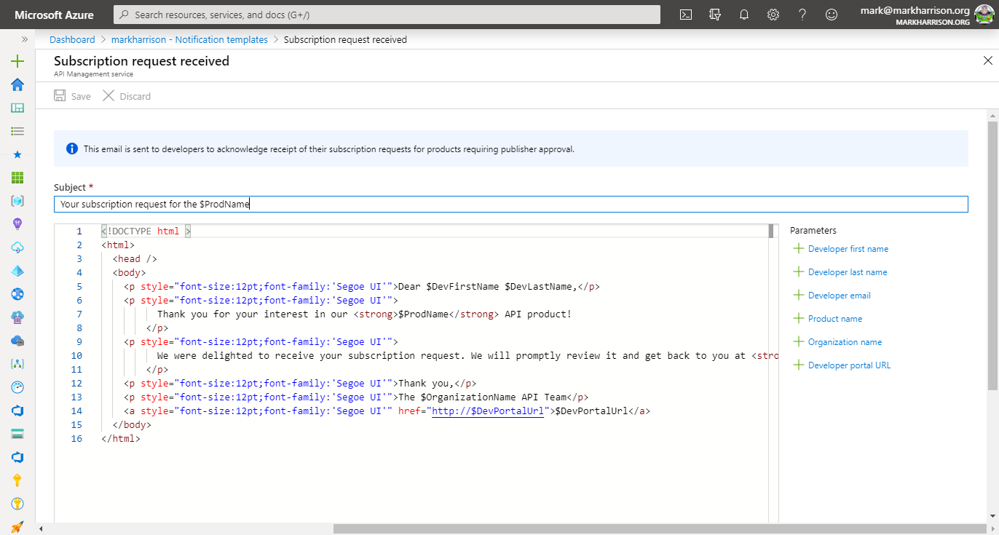

### Zarządzanie prouktami

Produkty zawierają jedno lub kilka różnych API jak rownież skonfigurowane limity na liczbę wywołań. Do produktu można również skonfigurować "Warunki używania serwisu". W ramach konfiguracji mamy możliwość określenia sposobu aktywacji subskrypcji oraz widoczności dla poszczególnych grup developerów.

#### Definicja produktu

W Portalu Azure w usłudze API Management wybierze menu `Products`.

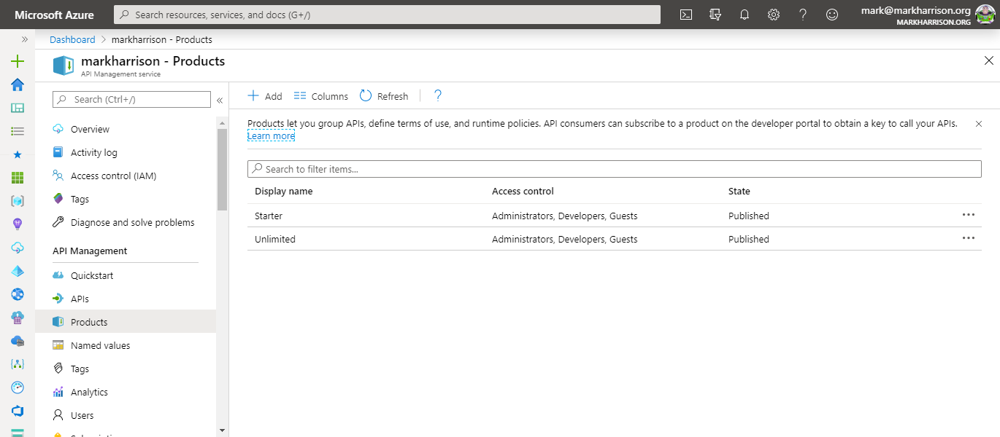

Dodaj nowy produkt, np. `Gold tier` - ustaw widoczność jako `Published` i naciśnij guzik `Create`.

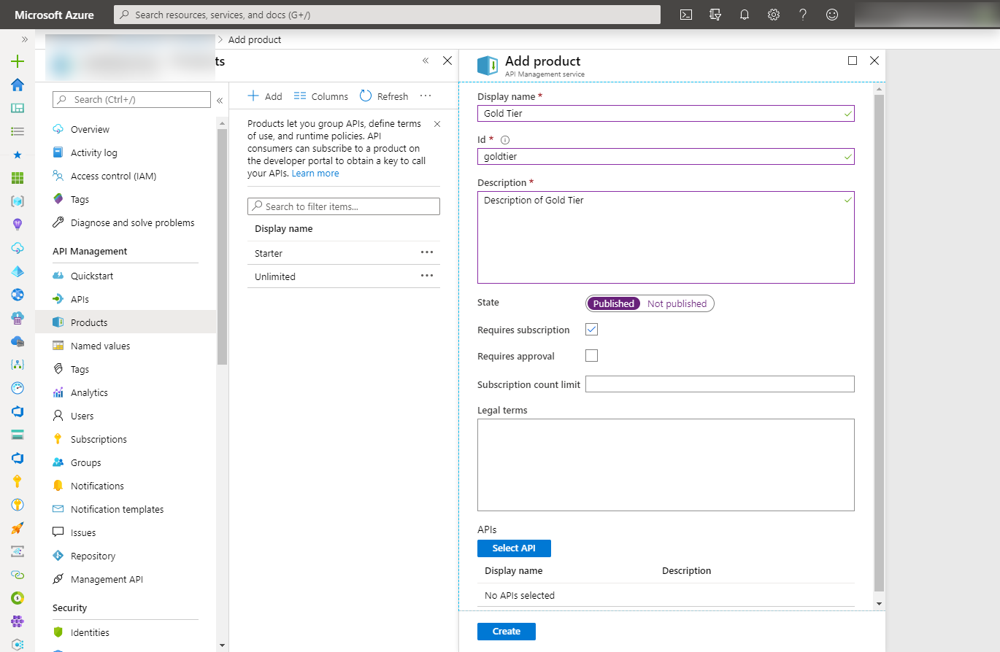

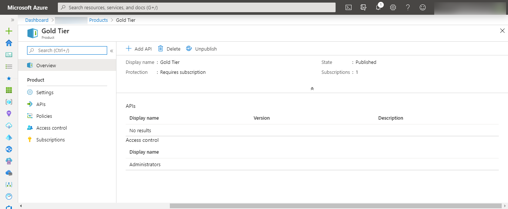

Skonfiguruj widoczność produktu dla Developerów

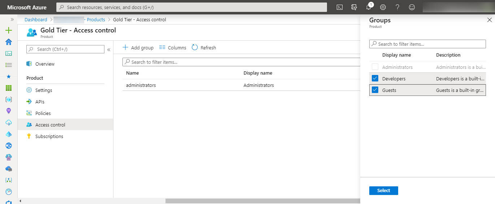

Zapisz zmiany i sprawdź widoczność produktu w Developer Portalu

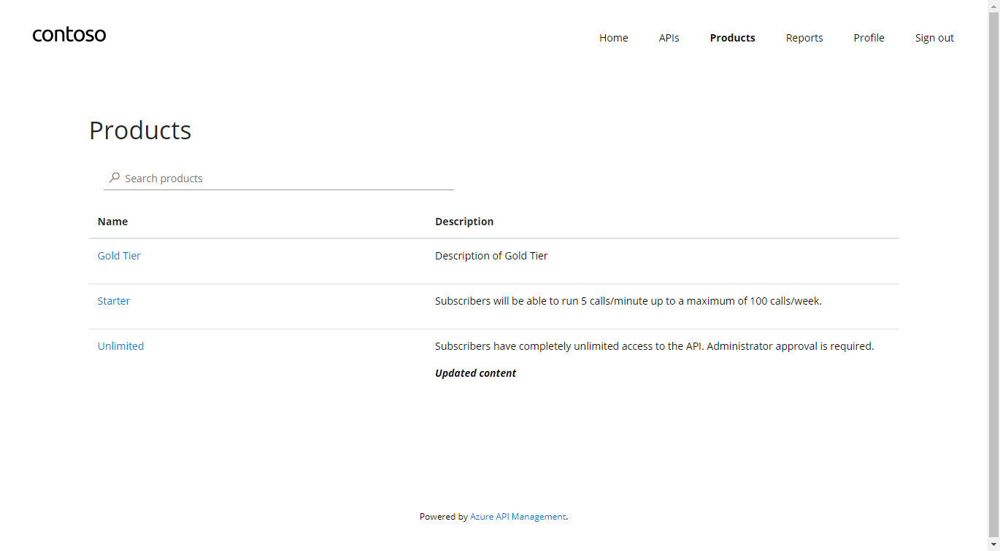

---

[Spis treści](README.md) | [Lab 1 - Utworzenie instancji API Management](apimanagement-1.md) | [Lab 3 - Konfiguracja API](apimanagement-3.md)
