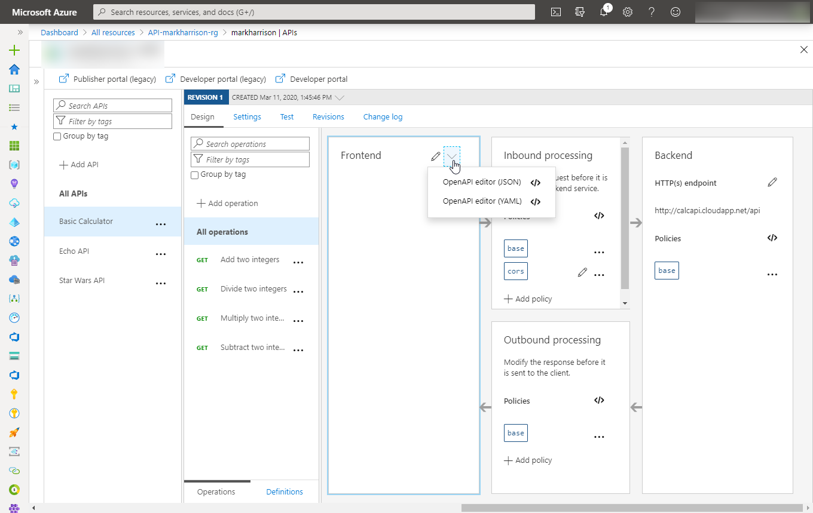
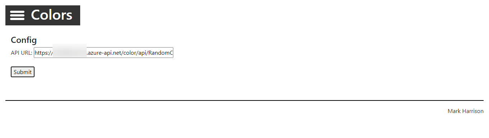

# Azure API Management - Warsztat zapoznawczy - Lab 3

- [Spis treści](README.md)
- [Lab 1 - Utworzenie instancji API Management](apimanagement-1.md)
- [Lab 2 - Portal dewelopera i tworzenie produktów](apimanagement-2.md)
- [Lab 3 - Konfiguracja API](apimanagement-3.md)
- [Lab 4 - Wyrażenia polityk API](apimanagement-4.md)
- [Lab 5 - Wersjonowanie, rewizje](apimanagement-5.md)
- [Lab 6 - Monitorowanie usługi](apimanagement-6.md)
- [Lab 7 - Aspekty bezpieczeństwa](apimanagement-7.md)
- [Lab 8 - Self-hosted gateway](apimanagement-8.md)
- [Lab 9 - FusionDev](apimanagement-9.md)

## API Management

Każde API dodane do API Management może być nastepnie dodane do produktu i opublikowane na Developer Portalu. Od tego momentu developerzy będą w stanie je testować i używać zgodnie z opisanymi przez nas politykami.

### Zakładka APIs

W Azure Portalu wybierze z menu zakładkę `APIs`. Zobaczysz listę skonfigurowanych API. W tym miejscu możesz dodawać, usuwać i modyfikować API.

### Ręczne dodanie API bez kontraktu

Zamiast implementwać własne API użyjemy gotowego `Star Wars API` <https://swapi.dev>.

- Kliknij `Add API`
  - Wybierz `Add Blank API`
  - Wybierz wersję `Full` na górze okna
  - Wpisz nazwę i opis API
  - Wpisz następujący `Backend Service`: <https://swapi.dev/api>
  - Wpisz API URL jako `sw`
  - Przypisz API do produktu, np: Started albo Unlimited
  - Stwórz API

Po utworzeniu wybierz z listy `Start Wars API`

Stwórzmy następujące operacje:

- **GetPeople** GET /people/ ... używaj małych znaków
- **GetPeopleById** GET /people/{id}/ ... używaj małych znaków

Następny krok to konfiguracja CORS dla naszego API

Wybierz `Star Wars API`, a następnie `All Operations`. W sekcji `Inbound processing` wybierze [Add policy]

Wybierz `CORS`

Ustaw CORS tak, jak na załączonym zrzucie ekranu. W rzeczywistości CORSy powinny być ustawione pod konkretne wymagania, w tym miejscu robimy uproszczoną konfigurację na potrzeby demo.

Po zapisaniu polityki możemy przejrzeć jej kod uzywając [Code View]

Uruchom ponownie Developer Portal

- Zaloguj się jako deweloper z aktywną subskrypcją do produktu w którym zostało skonfigurowane API.
- Wybierz `Start Wars API`

- Przetestuj działanie operacji `GetPeople`
- Przetestuj działanie operacji `GetPeopleById` używając id = 2

Przyjrzyj się odpowiedzi z serwisu

- Status odpowiedzi
- Informacje na temat C-3PO w Body uzyskanej odpowiedzi.

#### Zaimportuj API za pomocą Swaggera

Zamiast ręcznie definiować metody API możemy je zaimportować automatycznie do usługi. Standard [OpenAPI](https://www.openapis.org/) (aka [Swagger](https://swagger.io)) służy do opisu kontraktów API RESTowych.

Na potrzeby demo użyjemy API prostego kalkulatora : [Calc API](http://calcapi.cloudapp.net/)

Przejdź do zakładki `APIs` i wybierze `Add OpenAPI Specification`

- Ustaw URL definicji na <http://calcapi.cloudapp.net/calcapi.json>
  - Niektóre pola powinny się automatycznie zczytać z definicji
  - Jako API suffix wpisz `calc`
  - Przypisz API do produktu, np: Started albo Unlimited

- Skonfiguruj CORSy podobnie jak w poprzednim API
- Zanjdź nowe API w Developer Portalu
  - Wypróbuj API (np. dodawanie dwóch liczb całkowitych)
- Przyjrzyj się uzyskanej odpowiedzi

Możesz przejrzeć całą konfigurację API poprzez naciśnięcie `Edit` w sekcji Frontend:

Trzeci przykład to Colors API [Colors API](https://markcolorapi.azurewebsites.net/swagger/)

- Stwórz nowe API przez import definicji z następującego adresu: <https://markcolorapi.azurewebsites.net/swagger/v1/swagger.json>
  - Jako API suffix użyj "color".

- Uzupełnij CORSy

W tym przypadku Swagger nie zawierał nazwy hosta:

- Wejdź w `Settings`
- Uzupełnij `Web Service URL` jako <https://markcolorapi.azurewebsites.net>

- Przetetsuj działanie API w zakładce `Test`

#### Rate limit

Wejdź na [stronę Colors](https://markcolorweb.azurewebsites.net) wyświetlającą 500 świateł. Każde ze świateł w losowych odstępach czasu odpytuje RandomColor API i wyświetla otrzymany kolor.

- W menu strony wstaw adres swojego API

- W tym celu przygotuj następujący URL:

  - <https://YOURAPIM.azure-api.net/color/api/RandomColor?key=> _Starter-Key_
  - <https://YOURAPIM.azure-api.net/color/api/RandomColor?key=> _Unlimited-Key_

- Produkt Unlimited nie ma limitów

- Produkt Starter ma limit 5 wywołań na minutę.
- Powinien pojawić się błąd, np: _{ "statusCode": 429, "message": "Rate limit is exceeded. Try again in 54 seconds." }_

---

[Spis treści](README.md) | [Lab 2 - Portal dewelopera i tworzenie produktów](apimanagement-2.md) | [Lab 4 - Wyrażenia polityk API](apimanagement-4.md)
