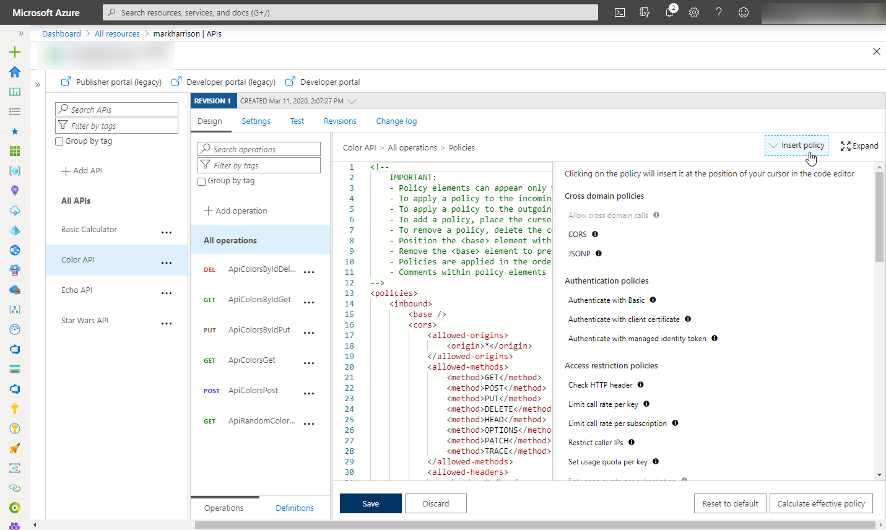

# Azure API Management - Warsztat zapoznawczy - Lab 4

- [Spis treści](README.md)
- [Lab 1 - Utworzenie instancji API Management](apimanagement-1.md)
- [Lab 2 - Portal dewelopera i tworzenie produktów](apimanagement-2.md)
- [Lab 3 - Konfiguracja API](apimanagement-3.md)
- [Lab 4 - Wyrażenia polityk API](apimanagement-4.md)
- [Lab 5 - Wersjonowanie, rewizje](apimanagement-5.md)
- [Lab 6 - Monitorowanie usługi](apimanagement-6.md)
- [Lab 7 - Aspekty bezpieczeństwa](apimanagement-7.md)

## Wyrażenia

Przy pomocy polityk można definiować działanie bramy dla poszczególnych API oraz określać w jaki sposób są one wywoływane. Przy pomocy wyrań pisanych w języku C# można uzyskać kontekst wywołania, kontekst użykownika, informacje o konfiguracji jak też w "locie" wykonywać dodatkowe operacje, sprawdzenia i zmiany.

Szczegółową dokumentację można znaleźć [tutaj](https://docs.microsoft.com/en-us/azure/api-management/api-management-policies).

### Konfiguracja

Wybierz `Color API`

- Zauważ, że możesz konfigurować Frontend, Inbound processing, Outbound processing, Backend
  - Użyj ikony ołówka w każdej z części
- Konfoguracja może dotyczyć wszystkich API, wszystkich operacji jednego API lub każdej z metod osobno.


Przejdź do edycji Frontendu

- Podczas edycji metody - można uzyć 'Code View' albo formularza do edycji.
- Podczas edycji API jedyną możliwością edycji jest 'Code View'.
- Przy pomocy 'Code View' możemy modyfikować Swagger (OpenAPI).


- Przejdź do edycji Inbound processing / Outbound processing / Backend
- Sprawdź działanie `Code View` i `Add Policy`.





### Przykłady

#### HTTP Response Caching

```xml
<!-- Inbound -->
<cache-lookup vary-by-developer="false"
              vary-by-developer-groups="false"
              downstream-caching-type="none" />

<!-- Outbound -->
<cache-store duration="15" />
```

#### Transformacja - XML/JSON

Częstym wymaganiem podczas integracji ze starszymi API jest transformacja pomiędzy XML oraz JSON.

`Calc API`, którego uzywaliśmy wcześniej zwraca odpowiedzi w XML.

- Otwórz Calculator API 'Code View'
- Dodaj policy w sekcji `Outbound` w celu transformacji do JSON
- Przetestuj działanie API - powinno zwracać JSON.

```xml
<!-- Outbound -->
<xml-to-json kind="direct" apply="always" consider-accept-header="false" />
```


#### Named Values

Named Values (tzw. Properties) to kolekcja par klucz/wartość dostępna dla instancji API Management. Pary zdefiniowane w `Named Values` mogą być wykorzystywane jako wartości konfiguracyjne we wszystkich politykach i wyrażeniach. Poza statycznymi wartościami wspierane są też wyrażenia oraz wartości zaszyfrowane.

- Stwórz klucz `TimeNow` o wartości `@(DateTime.Now.ToString())`.


- Otwórz `Code View` dla Calculator API
- Dodaj `Inbound policy` w celu dodania nagłówka
- Przetestuj API w zakładce `Test`
  - Dodaj nagłówek [Ocp-Apim-Trace] o wartości `true`
  - Przejrzyj wyniki w [Trace]

```xml
<!-- Inbound -->
<set-header name="timeheader" exists-action="override">
    <value>{{TimeNow}}</value>
</set-header>
```


- Sprawdź czy `timeheader` został wysłany do API.


#### Usuwanie nagłówków

Dość często pojawia sie potrzeba usuwania nagłówków w celu zwiekszenia bezpieczeństwa rozwiązania.

- Otwórz 'Code View' dla Calculator API
- Dodaj usuwanie nagłówków w sekcji `Outbound'
- Przetestuj działanie API

```xml
<!-- Outbound -->
<set-header name="x-aspnet-version" exists-action="delete" />
<set-header name="x-powered-by" exists-action="delete" />
```

Before:


After policy applied:


#### Warunki

Poniższy przykład modyfikuje zawartość odpowiedzi z API w zależnoci od użytego Produktu. Użytkownicy z wersją `Starter` dostaną tylko część informacji.

- Otwórz Star Wars API, metodę GetPeopleById i `Code View`
- Dodaj poniższą politykę w sekcji `Outbound`
- Przetestuj API używając klucza subskrypcji Starter
- Przetestuj API używając klucza subskrypcji Unlimited

```xml
<!-- Inbound -->
        <set-header name="Accept-Encoding" exists-action="override">
            <value>deflate</value>
        </set-header>
<!-- Outbound -->
<choose>
    <when condition="@(context.Response.StatusCode == 200 && context.Product.Name.Equals("Starter"))">
        <set-body>@{
                var response = context.Response.Body.As<JObject>();
                foreach (var key in new [] {"hair_color", "skin_color", "eye_color", "gender"}) {
                    response.Property(key).Remove();
                }
                return response.ToString();
            }
        </set-body>
    </when>
</choose>
```

Dla subskrypcji Starter:


Dla subskrypcji Unlimited:


#### Przerwanie przetwarzania

- Otwórz 'Code View' dla Calculator API
- Dodaj politykę `Inbound', która testuje warunek i zwraca błąd.
- Przetestuj API - powinno zwrócić kod błędu 599

```xml
<!-- Inbound -->
<choose>
    <when condition="@(true)">
        <return-response response-variable-name="existing response variable">
            <set-status code="599" reason="failure" />
            <set-header name="failure" exists-action="override">
                <value>failure</value>
            </set-header>
            <set-body>Nie działa</set-body>
        </return-response>
    </when>
</choose>
```


#### Mockowanie

Mocking provides a way to return sample responses even when the backend is not available. This enables app developers to not be help up if the backend is under development.

- Otwórz Star Wars API i kliknij [Add Operation]
- Dodaj nową metodę `GetFilm`
- W zakładce Response wklej poniższy kod


```json
{
  "count": 1,
  "films": [{ "title": "A New Hope", "blah": "xxx" }]
}
```

- Otwórz Inbound processing `Code View`
- Włącz mokowanie dla metody i ustaw kod odpowiedzi na 200


- Mocking zostało włączone.


- Przetestuj działanie API


---

[Home](README.md) | [Lab 4 - Konfiguracja API](apimanagement-3.md) | [Lab 5 - Wersjonowanie, rewizje](apimanagement-5.md)
