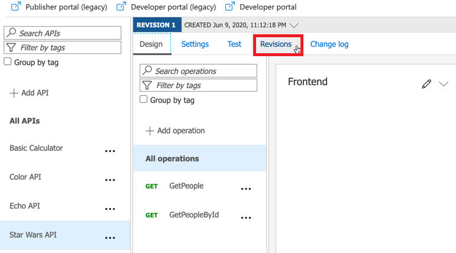
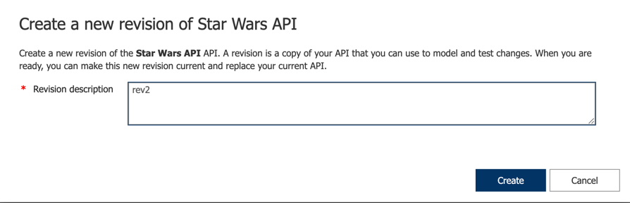
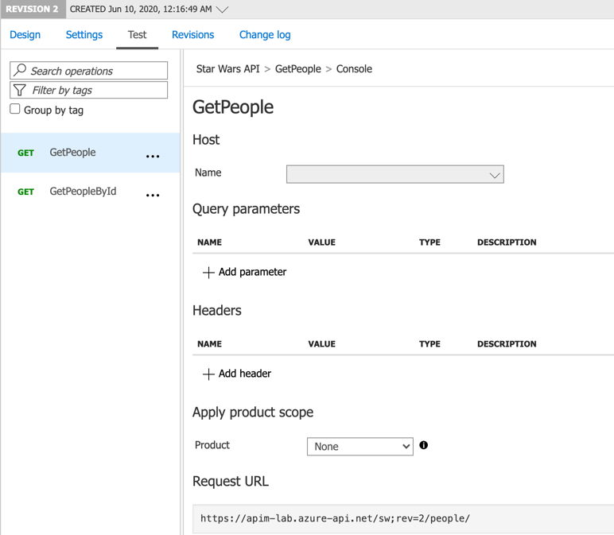
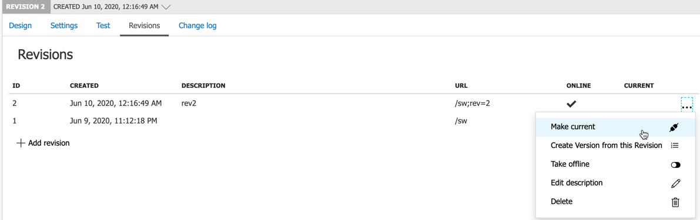
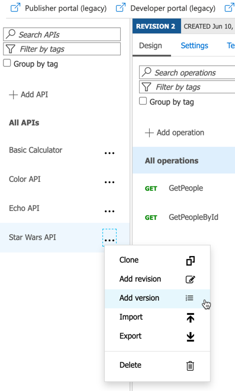
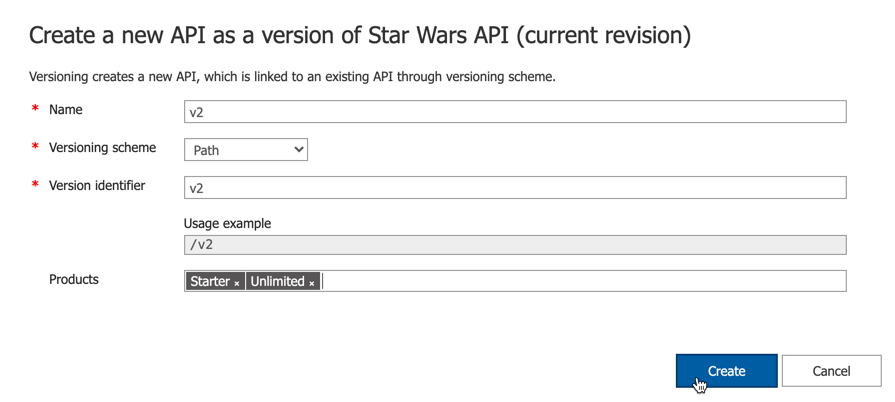
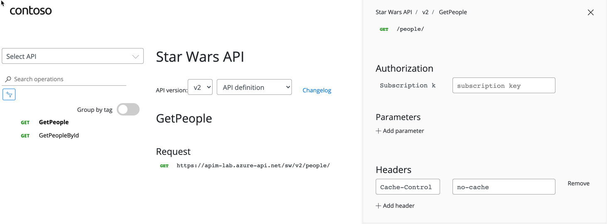

# Azure API Management - Warsztat zapoznawczy - Lab 5

- [Spis treści](README.md)
- [Lab 1 - Utworzenie instancji API Management](apimanagement-1.md)
- [Lab 2 - Portal dewelopera i tworzenie produktów](apimanagement-2.md)
- [Lab 3 - Konfiguracja API](apimanagement-3.md)
- [Lab 4 - Wyrażenia polityk API](apimanagement-4.md)
- [Lab 5 - Wersjonowanie, rewizje](apimanagement-5.md)
- [Lab 6 - Monitorowanie usługi](apimanagement-6.md)
- [Lab 7 - Aspekty bezpieczeństwa](apimanagement-7.md)

## Wersjonowanie i rewizje

Przy pomocy wersjonowania i rewizji w łatwy sposób można zarządzać cyklem życia API. [https://azure.microsoft.com/en-us/blog/versions-revisions/](https://azure.microsoft.com/en-us/blog/versions-revisions/)

Rewizje pozwalają wykonywać drobne zmiany w API, które nie zmieniają funcjonalności (non-breaking). Przy pomocy rewizji można niezauważalnie podmieniać zmiany i cofać do poprzedniego stanu. Jednocześnie wydanie rewizi i jej opublikowanie może zostać oznaczine w `Change log` dla API.

### Rewizje

#### Dodawanie rewzji

- Wybierz Star Wars API
- Wybierze `Revisions`
- Dodaj nową rewizję o nazwie `rev2`

#### Add caching

- Wybierz metodę `GetPeople`
- Dodaj politykę cacheowania na 10 sekund

#### Przetestuj rewizję

- Użyj zakładki `Test` do przetestowaia nowej wersji `GetPeople`
- Zauważ, że numer rewizji (innej niż domyślna) jest dokłądany na końcu URL.

Adres żądania powinien wyglądać w następujący sposób: `https://<your-apim-name>.azure-api.net/sw;rev=2/people/`.

#### Zmień aktualną rewizję

- Wejdź do zkładki `Revisions`
- Ustaw rewizję `rev2` jako `Current`.

### Wersjonowanie

#### Dodawanie nowej wersji

- Wybierz Star Wars API
- Dodaj nową wersję
  - Ustaw nazwę na `v2`
  - Użyj wersjonowania po ścieżce
  - Skonfihuruj produkty `Starter` oraz `Unlimited`

#### Przetestuj nową wersję

- Otwórz Developer Portal
- Znajdź wersję `v2` dla Star Wars API
- Zauważ że URL zawiera składnik `v2` w ścieżce
- Przetestuj metodę `GetPeople`

---

[Home](README.md) | [Lab 4 - Wyrażenia polityk API](apimanagement-4.md) | [Lab 6 - Monitorowanie usługi](apimanagement-6.md)
