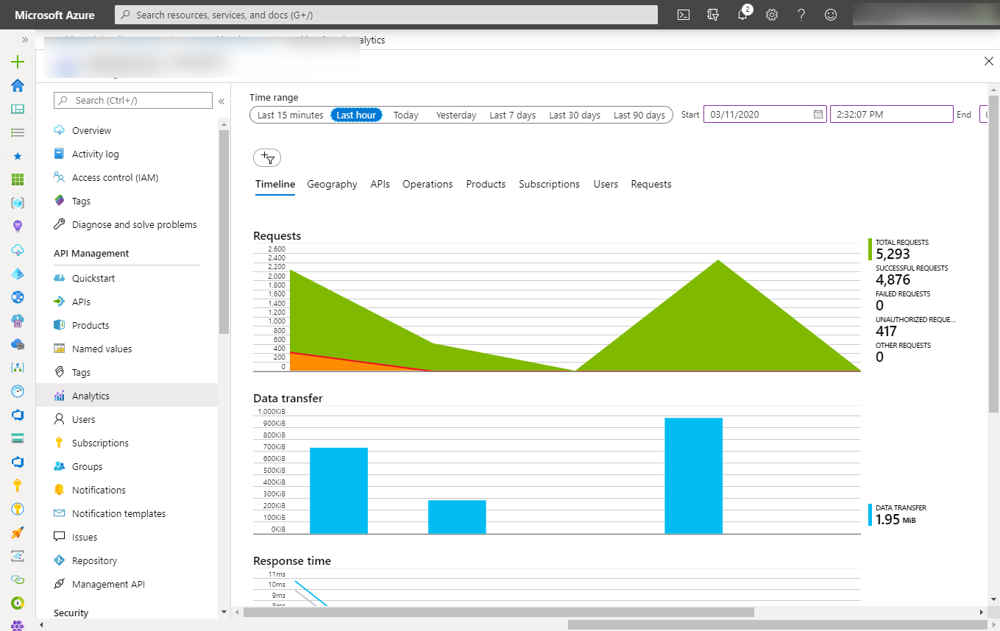
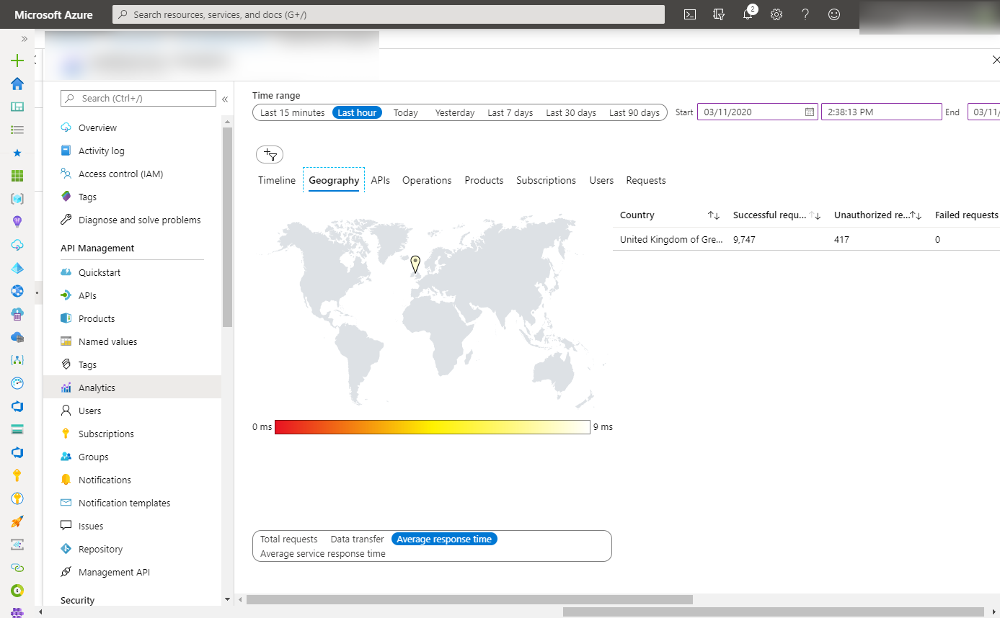
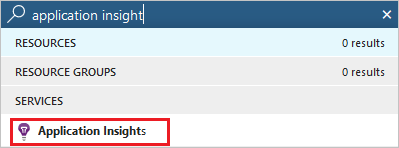
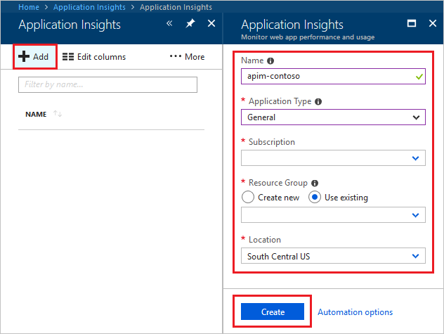
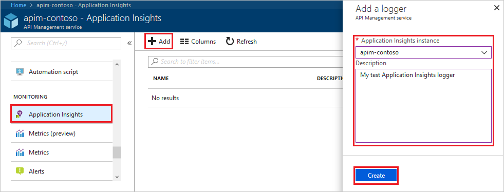
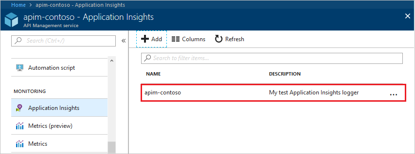
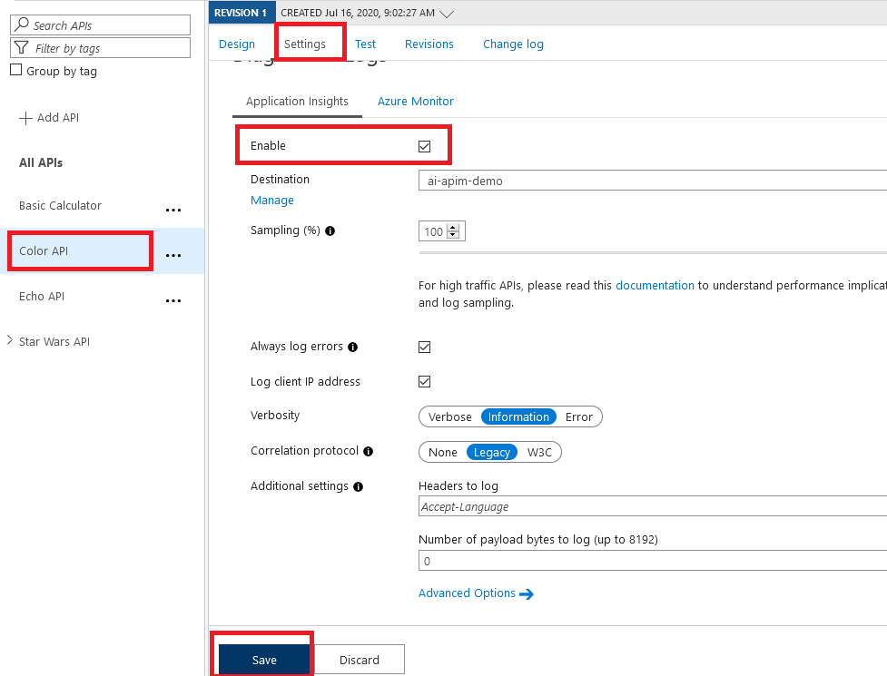
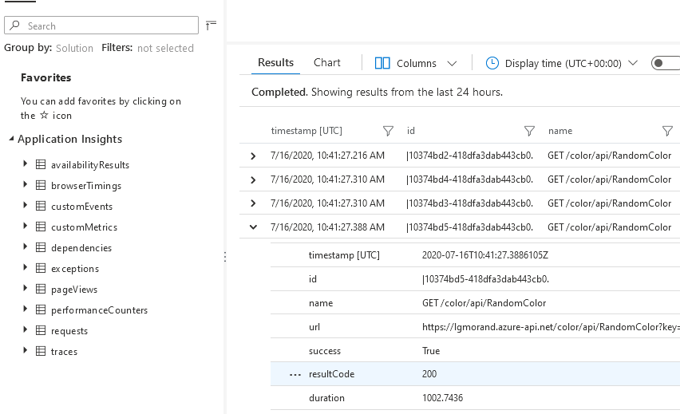

# Azure API Management - Warsztat zapoznawczy - Lab 6

- [Spis treści](README.md)
- [Lab 1 - Utworzenie instancji API Management](apimanagement-1.md)
- [Lab 2 - Portal dewelopera i tworzenie produktów](apimanagement-2.md)
- [Lab 3 - Konfiguracja API](apimanagement-3.md)
- [Lab 4 - Wyrażenia polityk API](apimanagement-4.md)
- [Lab 5 - Wersjonowanie, rewizje](apimanagement-5.md)
- [Lab 6 - Monitorowanie usługi](apimanagement-6.md)
- [Lab 7 - Aspekty bezpieczeństwa](apimanagement-7.md)
- [Lab 8 - Self-hosted gateway](apimanagement-8.md)
- [Lab 9 - FusionDev](apimanagement-9.md)

## Podstawowy monitoring przy użyciu Azure Monitor

Podstawowy monitoring i logowanie są dostępne w Portalu Azure w zakładce Analytics

- Dashboard zawiera następujące szczegóły: Timeline | Geography | APIs | Operations | Products | Subscriptions | Users | Requests

## Integracja API Management z Application Insights

Azure API Management umożliwia integrację z usługą Azure Application Insights. Application Insights, to rozszerzalna usługa zarządzania wydajnością aplikacji (APM) dla deweloperów i administratorów. Służy do monitorowania aplikacji na żywo. Automatycznie wykrywa anomalie wydajności i oferuje zaawansowane narzędzia analityczne ułatwiające diagnozowanie problemów oraz zrozumienie, jaki użytkownicy faktycznie korzystają z aplikacji.

### Tworzenie Azure Application Insights

1. Otwórz **Portal Azure** i w górnym oknie wyszukiwania wpisz i wybierz **Application Insights**.
   
2. Wciśnij **+ Add**.
   
3. Wypełnij potrzebne dane, wpisz **General** w polu **Application Type**.
4. Kliknij **Create**.

### Podłącz Application Insights do Azure API Management

1. Wejdź do swojej instancji API Management w Portalu Azure.
2. Wybierze **Application Insights** z menu po lewej stronie.
3. Kliknij **+ Add**.
   
4. Z listy wybierz **Application Insights**, które stworzyłeś/stworzyłaś.
5. Kliknij **Create**.
6. Właśnie stworzyłeś logger wpięty do Application Insights
   

### Włącz logowanie w API

1. Wejdź do swojej instancji API Management w Portalu Azure.
2. Wybierz **Color API**.
3. Przejdź do zakładki **Settings** w API.
4. Przewiń ustawienia w dół aż do sekcji **Diagnostics Logs**.
   
5. Zaznacz checkbox **Enable**.
6. Wybierz skonfigurowany wcześniej logger w polu **Destination**.
7. Wybierz **100%** samplowania i zaznacz **Always log errors**.
8. Kliknij **Save**.

### Dane wysyłane do Application Insights

Dane otrzymywane przez Azure Application Insights:

- **Request** telemetry item, dla każdego żądania (_frontend request_, _frontend response_),
- **Dependency** telemetry item, dla każdego żądania przekazanego do backendu (_backend request_, _backend response_),
- **Exception** telemetry item, dla każdego nieudanego żądania

Do nieudanego żądania zaliczane są:

- Połączenie zakmnięte po stronie klienta
- Przetwarzanie żądania które spododowało błąd (odpaliła się sekcja on-error)
- API odpowiedziało kodem błędu 4xx lub 5xx.

Po kilku sekundach do Application Insights powinny zaczać spływać pierwsze metryki.

UWAGA: Włączanie logowania, szczególnie przy samplowaniu na poziomie 100% może znacząco obniżyć przepustowość bramy API i czasy odpowiedzi.

---

[Home](README.md) | [Lab 5 - Wersjonowanie, rewizje](apimanagement-5.md) | [Lab 7 - Aspekty bezpieczeństwa](apimanagement-7.md)
