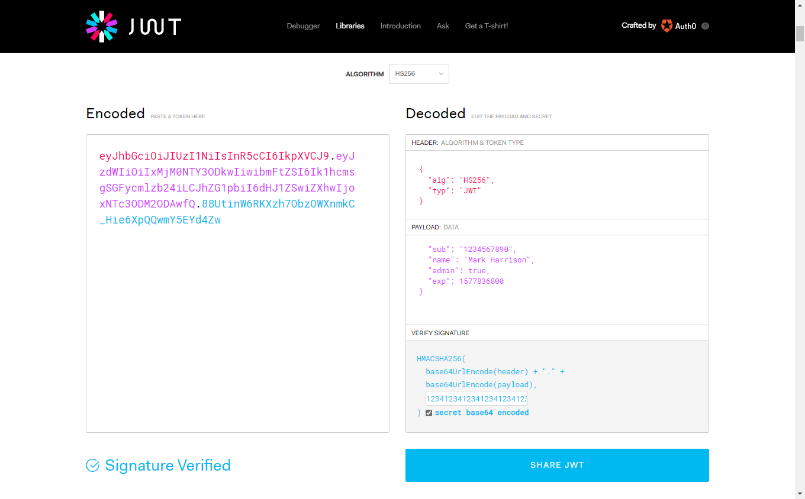
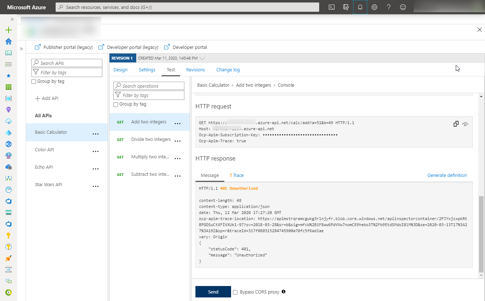
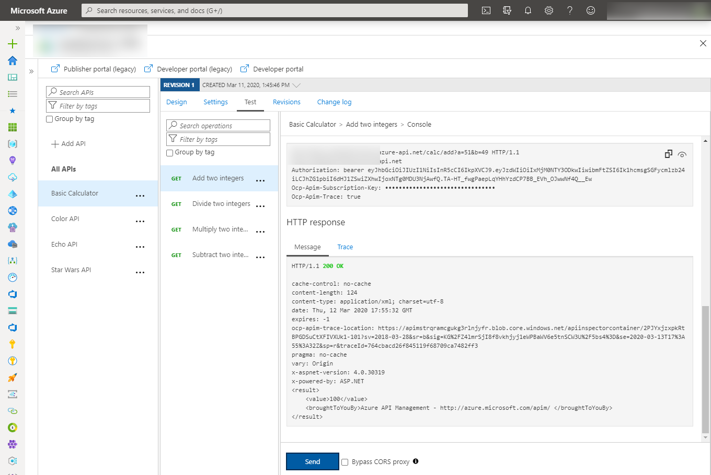
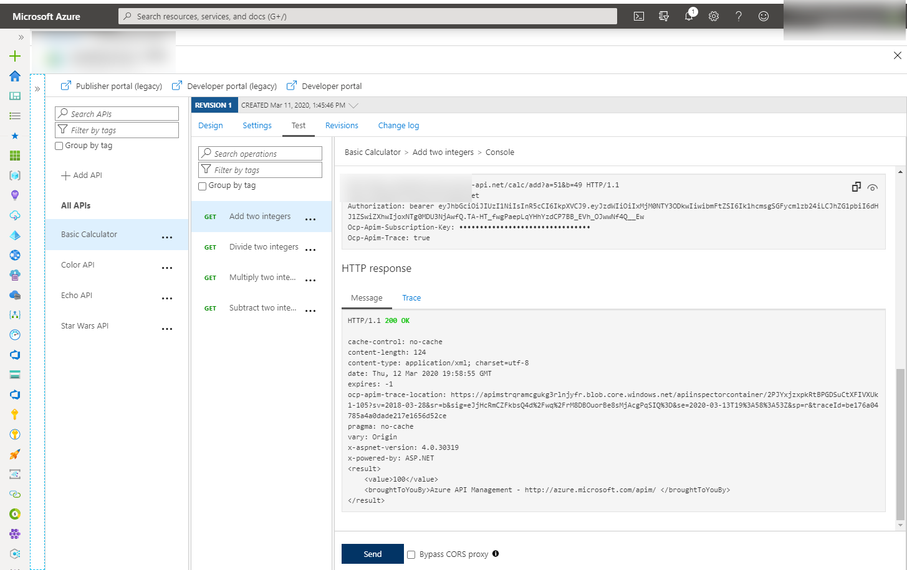
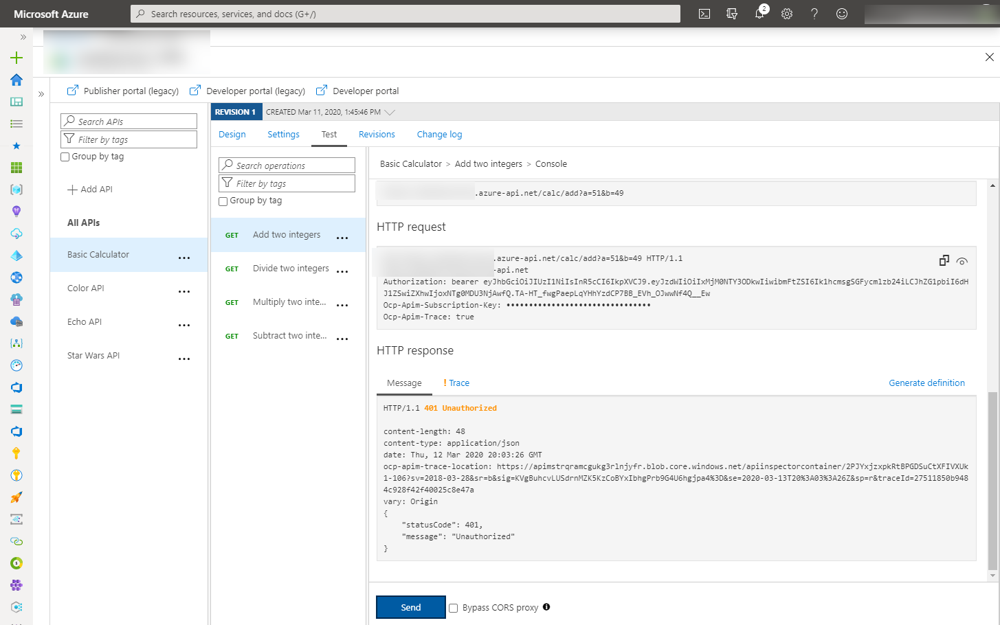
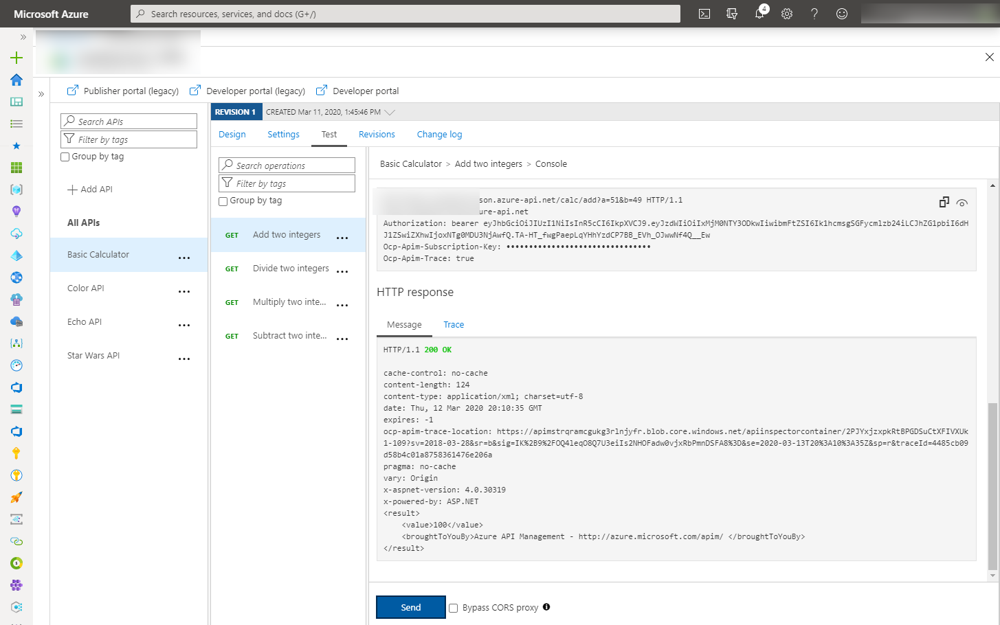
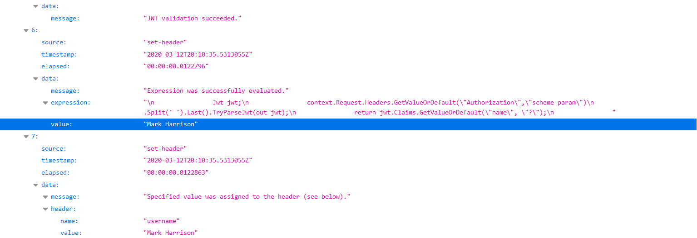

# Azure API Management - Warsztat zapoznawczy - Lab 7

- [Spis treści](README.md)
- [Lab 1 - Utworzenie instancji API Management](apimanagement-1.md)
- [Lab 2 - Portal dewelopera i tworzenie produktów](apimanagement-2.md)
- [Lab 3 - Konfiguracja API](apimanagement-3.md)
- [Lab 4 - Wyrażenia polityk API](apimanagement-4.md)
- [Lab 5 - Wersjonowanie, rewizje](apimanagement-5.md)
- [Lab 6 - Monitorowanie usługi](apimanagement-6.md)
- [Lab 7 - Aspekty bezpieczeństwa](apimanagement-7.md)

## Zabezpieczanie API przy pomocy OAuth

### JSON Web Tokens (JWT)

JSON Web Tokens JWT to standard przesyłania danych (claimów) w bezpieczny i podpisany (JWS) i/lub zaszyfrowany sposób (JWE) pomiędzy dwoma stronami API.

- W czasie tego lab będziemy używać następujących stron:
  - <https://jwt.io/> do tworzenia i podpisywania JWT
    - W tym celu musimy wyznaczyć wspólny klucz, np: 123412341234123412341234
  - <https://www.unixtimestamp.com/index.php>
    - Do tworzenia timestampów w formacie epoch np: 01/01/2020 = 1577836800



#### JSON Web Tokens (JWT) - walidacja

- Otwórz Calculator API i wejdź w 'Code View'
- W 'Inbound' processing dodaj politykę walidacji JWT
- Przykład zawiera również użycie i definiowanie zmiennych w wyrażeniu. Jest to przydatne kiedy zmienna używana jest w wielu miejscach.

```xml
<!-- Inbound -->
<set-variable name="signingKey" value="123412341234123412341234" />
<validate-jwt header-name="Authorization" failed-validation-httpcode="401" failed-validation-error-message="Unauthorized">
    <issuer-signing-keys>
        <key>@((string)context.Variables["signingKey"])</key>
    </issuer-signing-keys>
</validate-jwt>
```

- Przetestuj API, spodziewany wynik to [401 Unauthorized error]
- Przetestuj API dodając nagłówek Authorization (wygenerowany przez <https://jwt.io/>), spodziewany wynik to [200 success]
  - `Authorization: bearer TOKEN`

Zachowanie bez JWT:



Zachowanie z poprawnym JWT:



#### JSON Web Tokens (JWT) - sprawdzanie claimów

- Znajdź Calculator API i wejdź w 'Code View'
- Zmodyfikuj politykę `Inbound` w celu sprawdzenia, czy token zawiera claim 'admin'.
- Przetestuj API dodając nagłówek Authorization, spodziewany wynik to [200 success]
- Zmień politykę by oczekiwała claim o nazwie 'adminx'
- Przetestuj API dodając nagłówek Authorization, spodziewany wynik to [401 Unauthorized error]

```xml
<!-- Inbound -->
        <set-variable name="signingKey" value="123412341234123412341234" />
        <validate-jwt header-name="Authorization" failed-validation-httpcode="401" failed-validation-error-message="Unauthorized">
            <issuer-signing-keys>
                <key>@((string)context.Variables["signingKey"])</key>
            </issuer-signing-keys>
            <required-claims>
                <claim name="admin" match="any">
                    <value>true</value>
                </claim>
            </required-claims>
        </validate-jwt>
```

Sprawdzanie claim admin:



Sprawdzanie claim adminx:

```xml
<claim name="adminx" match="any">
```



#### JSON Web Tokens (JWT) - przekazywanie claimów do backendu

- Otwórz Calculator API i wejdź w 'Code View'
- Zmodyfukuj politykę `Inbound`
  - Pozostaw walidację tokenu JWT
  - Wczytaj claim 'name' z tokenu i wyślij w nagłówku do backendu.
- Przetestuj API dodając nagłówek Authorization, spodziewany wynik to [200 success]
- Sprawdź w Trace w zakładce Test co zostało wysłane do backendu.

```xml
<!-- Inbound -->
<set-header exists-action="override" name="username">
    <value>@{
        Jwt jwt;
        context.Request.Headers.GetValueOrDefault("Authorization","scheme param")
                            .Split(' ').Last().TryParseJwt(out jwt);
        return jwt.Claims.GetValueOrDefault("name", "?");
        }
    </value>
</set-header>
```




---

[Home](README.md) | [Lab 6 - Monitorowanie usługi](apimanagement-6.md)
