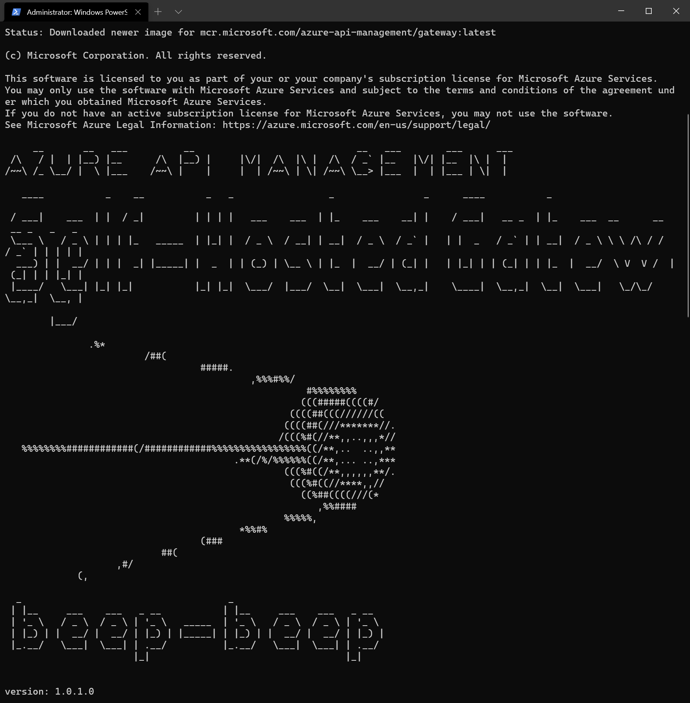
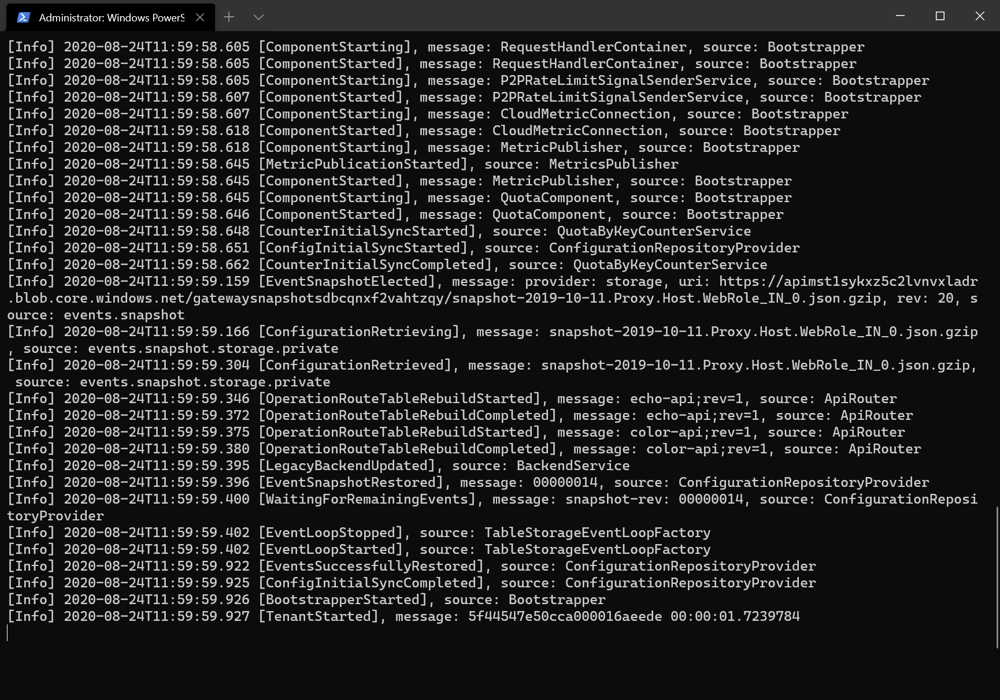
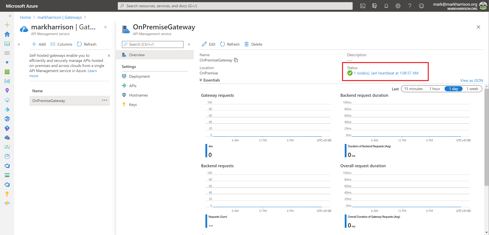
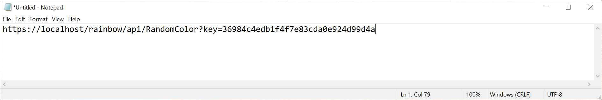
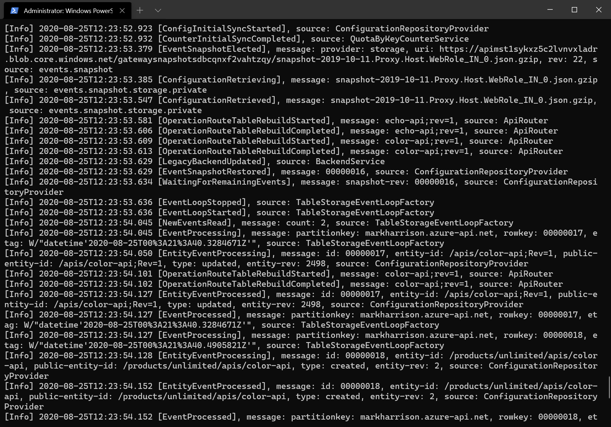

# Azure API Management - Warsztat zapoznawczy - Lab 8

- [Spis treści](README.md)
- [Lab 1 - Utworzenie instancji API Management](apimanagement-1.md)
- [Lab 2 - Portal dewelopera i tworzenie produktów](apimanagement-2.md)
- [Lab 3 - Konfiguracja API](apimanagement-3.md)
- [Lab 4 - Wyrażenia polityk API](apimanagement-4.md)
- [Lab 5 - Wersjonowanie, rewizje](apimanagement-5.md)
- [Lab 6 - Monitorowanie usługi](apimanagement-6.md)
- [Lab 7 - Aspekty bezpieczeństwa](apimanagement-7.md)
- [Lab 8 - Self-hosted gateway](apimanagement-8.md)
- [Lab 9 - FusionDev](apimanagement-9.md)

## Self-hosted gateway

Przy pomocy API Management self-hosted gateway firmy są w stanie wdrożyć usługę w wersji hybrydowej. W takim modelu brama API, przez którą przetwarzane są żądania może być hostowana w lokalnej serwerowni lub chmurze innego dostawcy.

Self-hosted gateways uruchamiana jest jako kontener w Docker lub w Kuberenetes. Brama następnie łączy się do chmurowej instancji API Management w celu pobrania danych konfiguracyjnych.

Lab zakłąda, że na komputerach uczestników zainstalowany jest Docker Desktop. Instrukcje dotyczące instalacji można znaleźć [tutaj](https://docs.docker.com/docker-for-windows/install/)

Warto zwrócić uwagę na dwa pojęcia:

- Gateway Deployment ... konfiguracja w usłudze API Management dotycząca zbioru Gateway Node(s)
- Gateway Node ... uruchomiona instancja (kontener) z bramą.

Istnieje możliwość uruchomienia wielu Gateway Deployment, jak też wielu Gateway Node w ramach jednego API Management Premium. W przypadku wersji Developer obie wartości wynoszą 1.  W wersji premium każde Gateway Deployments podlega dodatkowym kosztom, natomiast uruchomione w nich instancje Gateway Nodes są bezpłatne. To klient zapewnia niezbędne zasoby obliczeniowe (CPU/Ram) potrzebne do ich uruchomienia.


## Wdrożenie Self-hosted Gateway

W celu utworzenia Gateway Deployment:

- Wybierz opcję `Gateways` z menu w API Management
- Wybierz `+ Add`


- Wpisz nazwę i lokalizację
- Wybierz API dostępne w ramach bramy
  - Na potrzeby LAB wybierz Colors API
- Naciśnij przycisk `Add`


Brama powinna po chwili pojawić się na liście, to właśnie wspomniany wcześniej Gateway Deployment.


- Wejdź w szczegóły bramy, powinny pojawić się dodatkowe opcje konfiguracyjne.


- Wybierz `Deployment` z menu
  - Zauważ, że dostępne są przykładowe skrypty do wdrożenia w Docker i Kubernetes. Podczas tego Lab uzywamy opcji Docker.
- Zapisz plik *env.conf* na swoim komputerze.
- Skopiuj polecenie Dosker, ale usuń parametr *-d*, co sprawi, że logi pojawią się na ekranie konsoli podczas uruchomienia.

```text
docker run -p 80:8080 -p 443:8081 --name NAZWA --env-file env.conf mcr.microsoft.com/azure-api-management/gateway:latest
```


W lini poleceń z **prawami administratora**:

- Przejdź do lokalizacji, gdzie został ściagniety plik *env.conf*
- Uruchom skopiowane polecenie Docker


Pierwsze uruchomienie powinno potrwać chwilę dłużej, ponieważ ściąga ono obraz Docker z repozytorium. Do czasu opublikowania nowej wersji obrazu przez Microsoft każde kolejne uruchomienie powinno przebiegać znacznie szybciej.


Po ściągnięciu obrazu powinno pojawić się logo Sputnika (wewnętrzna nazwa kodowa rozwiązania w Microsoft) i logi diagnostyczne.






Zauważ, że w Portalu w API Managment powinna zaktualizować się liczba Gayeway Nodes (instancji) w ramach Twojego Gateway Deployment. Wszystkie zmiany, takie jak dodanie nowego API do bramy, powinny szybko synchronizowac się z instancją.



## Testowanie API

- Skopiuj swój klucz Unlimited (np. z Portalu Dewelopera).
- Dodaj klucz do poniższego URL. Zauważ też, że nasz Docker działa lokalnie i wykonamy żądanie na LocalHost.
  - https://localhost/colors/random?key=Unlimited-Key



- Wykonaj test w przeglądarce (uwaga na certyfikat), lub przy pomocy Curl.

W logach diagnostycznych bramy powinny pojawić się dodatkowe komunikaty.



---

[Home](README.md) | [Lab 7 - Aspekty bezpieczeństwa](apimanagement-7.md) | [Lab 9 - FusionDev](apimanagement-9.md)
